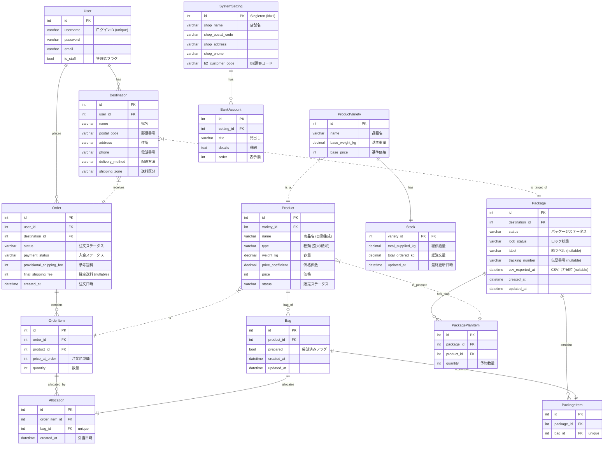

### **【成果物 4/11】 `04_データベース設計書` (Ver. 2.2)**

#### **1. はじめに**
本ドキュメントは、お米販売システムのデータベース構造を定義するものです。ER図による全体像の視覚的表現と、各テーブル（モデル）の詳細な定義で構成されます。

#### **2. ER図 (Entity Relationship Diagram)**
以下は、本システムの主要なエンティティとその関連性を示した図です。

#### **3. テーブル定義詳細**

* **凡例:**
  * **論理名:** システム内での日本語名称
  * **物理名:** データベース上でのカラム名
  * **データ型:** Djangoモデルフィールドに対応するデータ型
  * **必須:** `●` は必須項目 (NOT NULL)
  * **説明:** フィールドの役割や補足事項

##### **3.1. accountsアプリケーション**

**`User` (顧客アカウント)**

| 論理名 | 物理名 | データ型 | 必須 | 説明 |
| :--- | :--- | :--- | :--- | :--- |
| ログインID | `username` | CharField(150) | ● | 顧客のログインID。日本語も可。ユニーク制約。 |
| メールアドレス | `email` | EmailField | | （任意）顧客のメールアドレス。 |
| パスワード | `password` | CharField(128) | ● | ハッシュ化されたパスワード。 |
| スタッフ権限 | `is_staff` | BooleanField | ● | `True`の場合、管理者として扱われる。 |

**`Destination` (お届け先)**

| 論理名 | 物理名 | データ型 | 必須 | 説明 |
| :--- | :--- | :--- | :--- | :--- |
| 顧客 | `user` | ForeignKey (User) | ● | このお届け先を所有する顧客。 |
| 宛名 | `name` | CharField(255) | ● | |
| 郵便番号 | `postal_code` | CharField(10) | ● | |
| 住所 | `address` | CharField(255) | ● | |
| 電話番号 | `phone` | CharField(20) | ● | |
| 配送方法 | `delivery_method` | CharField(10) | ● | `YAMATO` (ヤマト配送) or `TEWATASHI` (直接手渡し) |
| 送料区分 | `shipping_zone` | CharField(10) | ● | `NORMAL` (通常) or `ENCHI` (遠地) |

##### **3.2. productsアプリケーション**

**`ProductVariety` (品種マスタ)**

| 論理名 | 物理名 | データ型 | 必須 | 説明 |
| :--- | :--- | :--- | :--- | :--- |
| 品種名 | `name` | CharField(100) | ● | 例: 「コシヒカリ」 |
| 基準重量(kg) | `base_weight_kg` | DecimalField | ● | 価格計算の基準となる重量。例: 30.00 |
| 基準価格(円) | `base_price` | IntegerField | ● | 上記基準重量あたりの価格。 |

**`Product` (商品マスタ)**

| 論理名 | 物理名 | データ型 | 必須 | 説明 |
| :--- | :--- | :--- | :--- | :--- |
| 品種 | `variety` | ForeignKey (ProductVariety) | ● | |
| 商品名 | `name` | CharField(255) | | 保存時に自動生成される。例: 「コシヒカリ 精米 5.00kg」 |
| 種類 | `type` | CharField(10) | ● | `GENMAI` (玄米) or `SEIMAI` (精米) |
| 容量(kg) | `weight_kg` | DecimalField | ● | |
| 価格係数 | `price_coefficient` | DecimalField | ● | 価格計算に用いる係数。 |
| 価格(円) | `price` | IntegerField | ● | 実際に販売される価格。 |
| 販売ステータス | `status` | CharField(10) | ● | `PREPARATION` (未公開), `FOR_SALE` (販売開始) など |

**`Stock` (在庫マスタ)**

| 論理名 | 物理名 | データ型 | 必須 | 説明 |
| :--- | :--- | :--- | :--- | :--- |
| 品種 | `variety` | OneToOneField (ProductVariety) | ● | 在庫管理の単位となる品種。 |
| 総供給量(kg) | `total_supplied_kg` | DecimalField | ● | 管理者が設定する、販売に割り当てられた玄米の総量。 |
| 総注文量(kg) | `total_ordered_kg` | DecimalField | ● | システムが自動更新する、累計の注文量（玄米換算）。 |
| 最終更新日時 | `updated_at` | DateTimeField | ● | レコードが更新されるたびに自動更新。 |

##### **3.3. ordersアプリケーション**

**`Order` (注文ヘッダー)**

| 論理名 | 物理名 | データ型 | 必須 | 説明 |
| :--- | :--- | :--- | :--- | :--- |
| 購入者 | `user` | ForeignKey (User) | ● | |
| お届け先 | `destination` | ForeignKey (Destination) | ● | |
| 注文ステータス | `status` | CharField(20) | ● | `NEW` (新規注文), `ACCEPTED` (注文受付) など |
| 入金ステータス | `payment_status` | CharField(20) | ● | `UNPAID` (未入金), `PAID` (入金済み) |
| **参考送料(円)** | `provisional_shipping_fee` | **IntegerField** | ● | **注文時にシミュレーションして算出した、購入者提示用の参考送料。** |
| **確定送料(円)** | `final_shipping_fee` | **IntegerField** | | **管理者が梱包確定した後の最終的な送料。NULLの場合は未確定とみなす。** |
| 注文日時 | `created_at` | DateTimeField | ● | レコード作成時に自動設定。 |

**`OrderItem` (注文明細)**

| 論理名 | 物理名 | データ型 | 必須 | 説明 |
| :--- | :--- | :--- | :--- | :--- |
| 注文 | `order` | ForeignKey (Order) | ● | |
| 商品 | `product` | ForeignKey (Product) | ● | |
| 注文時単価(円) | `price_at_order` | IntegerField | ● | 注文確定時点での商品単価。 |
| 数量 | `quantity` | PositiveIntegerField | ● | |

**`Bag` (物理的な袋)**

| 論理名 | 物理名 | データ型 | 必須 | 説明 |
| :--- | :--- | :--- | :--- | :--- |
| 商品 | `product` | ForeignKey (Product) | ● | この袋に詰められている（または詰められる予定の）商品。 |
| 袋詰済みフラグ | `prepared` | BooleanField | ● | `True`の場合、物理的な袋詰が完了していることを示す。 |

**`Allocation` (引当)**

| 論理名 | 物理名 | データ型 | 必須 | 説明 |
| :--- | :--- | :--- | :--- | :--- |
| 注文明細 | `order_item` | ForeignKey (OrderItem) | ● | 引当の対象となる注文明細。 |
| 袋 | `bag` | OneToOneField (Bag) | ● | 実際に引当られる物理的な袋。 |

**`Package` (荷物/箱)**

| 論理名 | 物理名 | データ型 | 必須 | 説明 |
| :--- | :--- | :--- | :--- | :--- |
| お届け先 | `destination` | ForeignKey (Destination) | ● | |
| パッケージステータス | `status` | CharField(20) | ● | `PACKAGING` (準備中), `READY_TO_SHIP` (発送準備完了) など |
| ロック状態 | `lock_status` | CharField(20) | ● | `UNLOCKED` (変更可), `APPEND_ONLY`, `LOCKED` (変更不可) |
| 箱ラベル | `label` | CharField(50) | | 管理者が任意で設定できるラベル。 |
| 伝票番号 | `tracking_number` | CharField(50) | | CSVインポートで設定される配送伝票番号。 |
| CSV出力日時 | `csv_exported_at` | DateTimeField | | ヤマトB2用CSVが出力された日時。 |

**`PackageItem` (パッケージ明細)
**

| 論理名 | 物理名 | データ型 | 必須 | 説明 |
| :--- | :--- | :--- | :--- | :--- |
| パッケージ | `package` | ForeignKey (Package) | ● | |
| 袋 | `bag` | OneToOneField (Bag) | ● | この箱に含まれる物理的な袋。 |

**`PackagePlanItem` (パッケージ計画/予約)**

| 論理名 | 物理名 | データ型 | 必須 | 説明 |
| :--- | :--- | :--- | :--- | :--- |
| パッケージ | `package` | ForeignKey (Package) | ● | |
| 商品 | `product` | ForeignKey (Product) | ● | 「袋在庫はないが、この箱に入れる予定」の商品。 |
| 予約数量 | `quantity` | PositiveIntegerField | ● | |

##### **3.4. system_settingsアプリケーション**

**`SystemSetting` (システム設定)**

| 論理名 | 物理名 | データ型 | 必須 | 説明 |
| :--- | :--- | :--- | :--- | :--- |
| 店舗・屋号名 | `shop_name` | CharField(100) | | 請求書等に記載する依頼主名。 |
| 郵便番号 | `shop_postal_code` | CharField(10) | | |
| 住所 | `shop_address` | CharField(255) | | |
| 電話番号 | `shop_phone` | CharField(20) | | |
| B2ご請求先顧客コード | `b2_customer_code` | CharField(50) | | ヤマトB2用CSVに出力するコード。 |

**`BankAccount` (振込先口座)**

| 論理名 | 物理名 | データ型 | 必須 | 説明 |
| :--- | :--- | :--- | :--- | :--- |
| システム設定 | `setting` | ForeignKey (SystemSetting) | ● | |
| 見出し | `title` | CharField(100) | ● | 例: 「郵便振替」「銀行振込」 |
| 詳細 | `details` | TextField | ● | 請求書に表示する口座情報。 |
| 表示順 | `order` | PositiveIntegerField | ● | 数字が小さい順に表示される。 |

