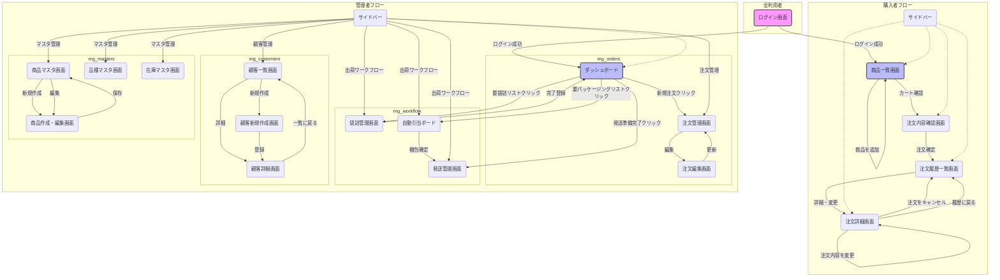

### **ステップ4-2：`05_画面遷移図.md` の更新**

アプリケーション構成が変更されたため、管理者フローの図と説明が、現在の実装と一致するように修正します。特にサイドバーからの遷移先が、各新アプリケーションの機能であることを明確にします。

以下に、更新後の`05_画面遷移図.md`の全内容を提示します。

---

### **【成果物 5/11】 `05_画面遷移図` (Ver. 3.0)**

#### **1. はじめに**
本ドキュメントは、お米販売システムの主要な画面とその遷移関係を視覚的に表現するものです。システムの利用者（購入者・管理者）が、どのような流れで操作を行うかを俯瞰的に理解することを目的とします。

#### **2. 画面遷移図**

#### **3. 主要フロー解説**

##### **3.1. 購入者フロー**
1.  **ログイン (`A`):** 利用者はまずログイン画面から認証を行います。
2.  **商品選択 (`B`):** ログイン後、商品一覧画面に遷移します。ここで購入したい商品と数量を選択し、お届け先ごとのカートに追加していきます。
3.  **注文確認 (`C`):** カートの内容が固まったら、注文内容確認画面に進み、送料を含めた最終的な金額やお届け先情報を確認します。
4.  **注文確定 (`D`):** 注文を確定すると、注文履歴一覧画面に遷移し、完了メッセージが表示されます。
5.  **詳細確認・変更 (`E`):** 履歴一覧から個別の注文を選択すると、注文詳細画面に遷移します。ステータスが「新規注文」であれば、ここから数量の変更や注文自体のキャンセルが可能です。

##### **3.2. 管理者フロー**
1.  **ログインとダッシュボード (`A` -> `G`):** 管理者としてログインすると、ToDoリスト形式のダッシュボード (`dashboard`アプリ) が表示され、次に行うべき作業を把握します。
2.  **注文処理 (`G` -> `H` -> `I`):**
    *   ダッシュボードから「新規注文」をクリックし、注文管理画面 (`H`, `mg_orders`アプリ) に遷移します。
    *   注文内容を確認し、「受付済み」にステータスを変更します。
    *   必要であれば「編集」ボタンから注文編集画面 (`I`) に入り、内容を修正します。
3.  **出荷ワークフロー (`G` -> `J` -> `K` -> `M`):**
    *   まず「要袋詰リスト」から袋詰管理画面 (`J`, `mg_workflow`アプリ) に遷移し、物理的な袋詰作業の完了を登録します。
    *   次に「要パッケージングリスト」から**自動引当ボード** (`K`) に遷移します。ここで、袋在庫と注文を紐付け、箱詰め計画を立てて「梱包確定」します。
    *   確定された荷物は発送管理画面 (`M`) に移動し、CSV出力や発送ステータスの更新を行います。
4.  **マスタ・顧客管理 (`S_ADMIN` -> `*_LIST` -> `*_DETAIL`/`*_FORM`):**
    *   サイドバーのメニューから、顧客管理 (`mg_customers`アプリ)、商品マスタ、品種マスタ、在庫マスタ (`mg_masters`アプリ) の各一覧画面に直接アクセスします。
    *   各一覧画面から「新規作成」や「編集」ボタンを押すことで、それぞれの詳細・編集画面に遷移し、データのメンテナンスを行います。

---

以上が、リファクタリング後の現状を反映した`05_画面遷移図`の更新版です。

ご確認いただき、問題ないようでしたら、次に`10_開発環境構築手順書.md`の更新に進みます。